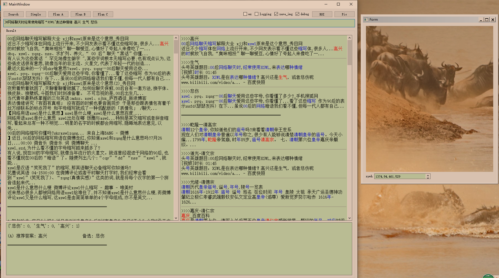

# 头号英雄答题助手

## 配置教程

- 安装 python 及相应的包
	```sh
	# 切换到项目目录下面，执行
	pip install -r requirements.txt
	```
	
- 申请 百度云 OCR API
	
	- 注册或登陆 [百度云](https://login.bce.baidu.com/)
	
	- 左侧“产品服务”->人工智能->文字识别，点击创建应用，在项目目录下创建"baidu_ocr.json"文件, 将创建的应用信息填入该文件
	
	```json
   {
	"APP_ID": "0000",
	"API_KEY": "xxxx",
	"SECRET_KEY": "xxxx"
	}
  ```
	
- 安装 scrcpy 投屏软件
	
	- 下载地址[win64](https://github.com/Genymobile/scrcpy/releases/download/v1.12.1/scrcpy-win64-v1.12.1.zip) or [win32](https://github.com/Genymobile/scrcpy/releases/download/v1.12.1/scrcpy-win32-v1.12.1.zip)
	- 下载完成，将下载的文件目录添加到系统环境变量
	
- 手机 usb 连接至电脑，打开手机的“开发者选项”，开启“usb 调试”

- 运行
	```sh
	# 退出 360 等安全软件，打开终端执行下面命令，开启投屏
	scrcpy
	# 在项目目录下运行以下命令，开启助手软件
	python toutiao_dev.py
	```

